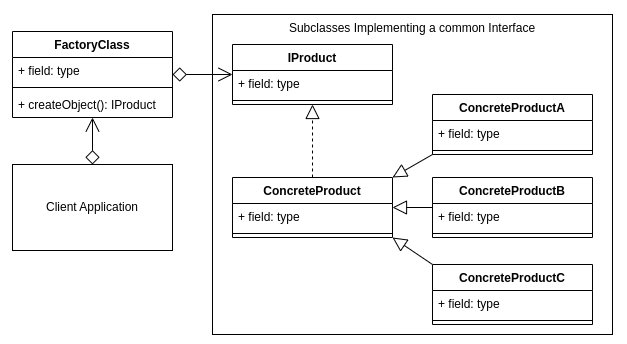

# Factory pattern

## Terminology

Concrete Creator: The client application, class or method that calls the Creator (Factory method).

Product Interface: The interface describing the attributes and methods that the Factory will require in order to create the final product/object.

Creator: The Factory class. Declares the Factory method that will return the object requested from it.

Concrete Product: The object returned from the Factory. The object implements the Product interface.

## Factory Use Case

An example use case may be a user interface where the user can select from a menu of items, such as chairs.

The user has been given a choice using some kind of navigation interface, and it is unknown what choice, or how many chairs the user will add until the application is actually running, and the user starts using it.

So, when the user selected the chair, the factory then takes some property involved with that selection, such as an ID, Type or other attribute and then decides which relevant subclass to instantiate in order to return the appropriate object.

While there are is a large amount of code in this example, and it is spread across several files, the actual factory is the ChairFactory class in the file chair-factory.ts. So, the factory is the part of your program that is creating a separation or abstraction between the instantiating of your object and where it is used.

## Summary

The Factory Pattern defers the creation of the final object to a subclass.
The Factory pattern is about inserting another layer/abstraction between instantiating an object and where in your code it is actually used.
It is unknown what or how many objects you will need to be created until runtime.
You want to localize knowledge of the specifics of instantiating a particular object to the subclass so that the client doesn't need to be concerned about the details.
You want to create an external framework, that an application can import/reference, and hide the details of the specifics involved in creating the final object/product.
The unique factor that defines the Factory pattern, is that your project now defers the creation of objects to the subclass that the factory had delegated it to.
