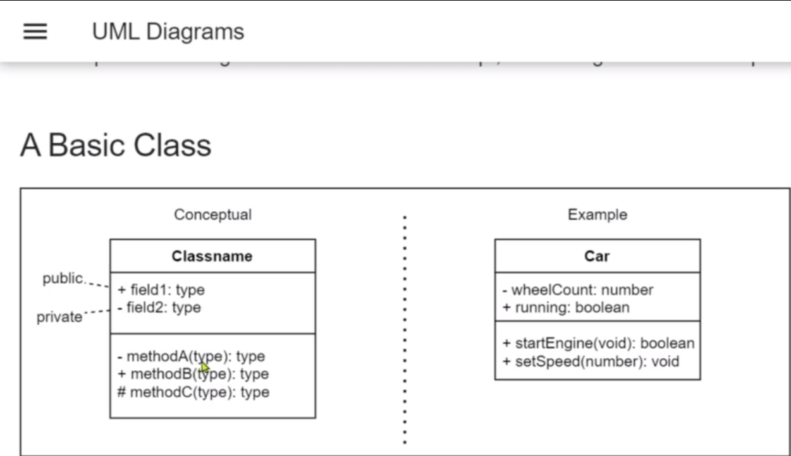
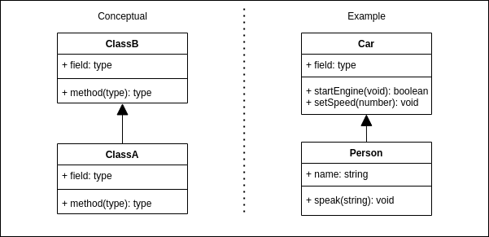
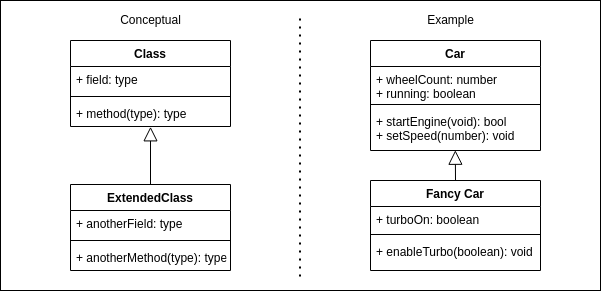
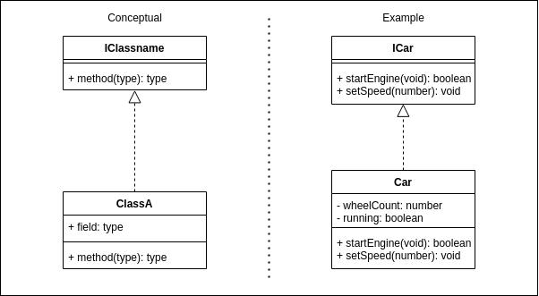
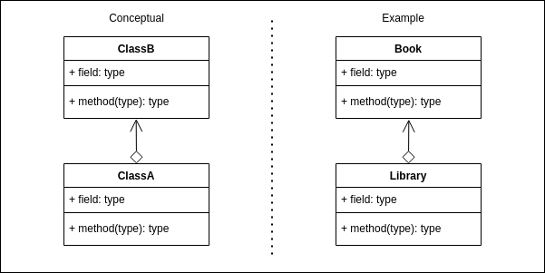
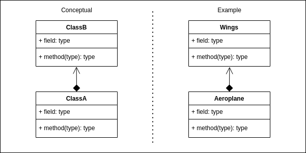
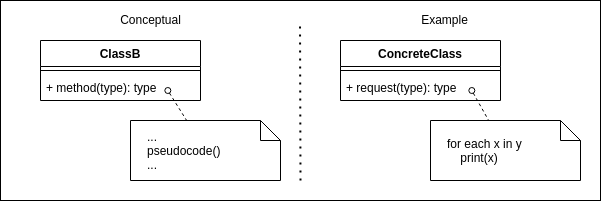

# Overview

Unified Modeling Language (UML) Diagrams are used throughout the course to help describe the patterns.

Below are some example self-describing UML diagrams.

The left part of the diagram shows the basic concept, and the right side shows a potential example usage.

## Directed Association

A filled arrow with a line.

ClassA uses ClassB or an object of ClassB.

ClassA calls a static class method, a static abstract method or a method/property/field from an object of type ClassB. e.g., The Person starts the Car engine.

## A Class That Extends/Inherits A Class

An unfilled arrow, with a line pointing to the class that is being extended/inherited.

ClassA extends ClassB.

The extended class contains all the attributes/fields and methods of the inherited class, including its own extra methods, attributes/fields, overrides and overloads.

## A Class That Implements an Interface

An unfilled arrow, with a dashed line pointing to the interface that is being implemented.

ClassA implements ClassB.

A class that implements an interface must implement all the methods declared in the interface.

## Aggregates

An unfilled diamond with a line and arrow head.

ClassA aggregates ClassB.

Library aggregates Books. Books and Library can exist independently of each other. Books can exist without the Library.

## Composition

A filled diamond with a line and arrow head.

ClassA is composed of ClassB

Aeroplane can be composed of Wings and other parts. But an aero plane is no longer really an aero plane without its wings.

## Pseudocode Annotation

A box with a dashed line and a circle placed near a class method.

Pseudocode is a plain language description of the steps in an algorithm and used to portray a concept without needing to write long lines of code.

